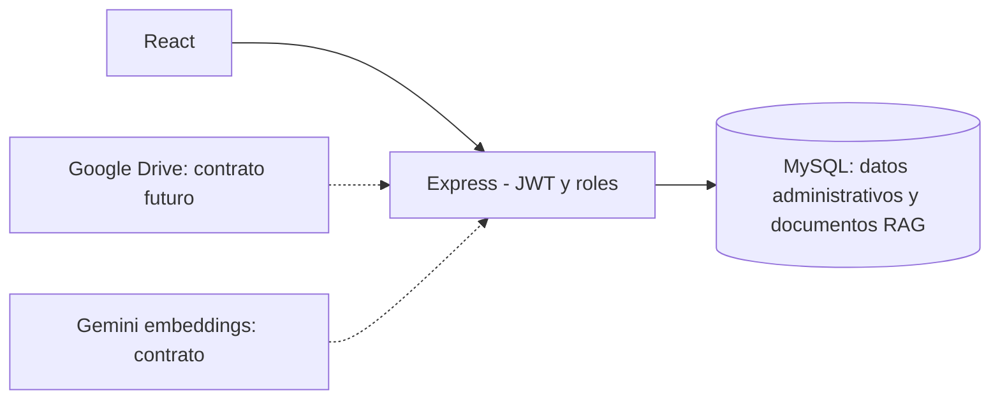
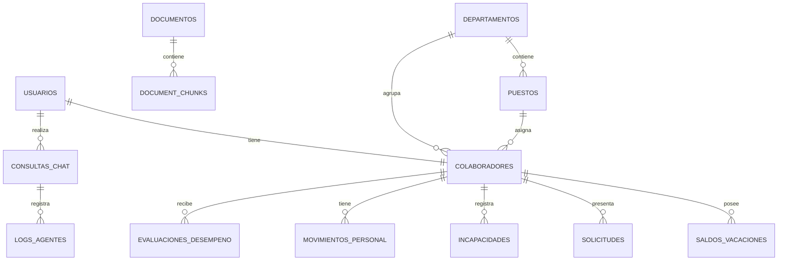

# Arquitectura de almacenamiento y relaciones

```mermaid
flowchart LR
  UI[React] --> API[Express - JWT y roles]
  API --> MYSQL[(MySQL: datos administrativos y documentos RAG)]
  DRIVE[Google Drive: contrato futuro] -.-> API
  GEMINI[Gemini embeddings: contrato] -.-> API
```

```mermaid
erDiagram
  USUARIOS ||--|| COLABORADORES : tiene
  DEPARTAMENTOS ||--o{ PUESTOS : contiene
  DEPARTAMENTOS ||--o{ COLABORADORES : agrupa
  PUESTOS ||--o{ COLABORADORES : asigna
  COLABORADORES ||--o{ SALDOS_VACACIONES : posee
  COLABORADORES ||--o{ SOLICITUDES : presenta
  COLABORADORES ||--o{ INCAPACIDADES : registra
  COLABORADORES ||--o{ MOVIMIENTOS_PERSONAL : tiene
  COLABORADORES ||--o{ EVALUACIONES_DESEMPENO : recibe
  USUARIOS ||--o{ CONSULTAS_CHAT : realiza
  CONSULTAS_CHAT ||--o{ LOGS_AGENTES : registra
  DOCUMENTOS ||--o{ DOCUMENT_CHUNKS : contiene
```

La relación `documentos` → `document_chunks` se implementa mediante una clave foránea en MySQL.
